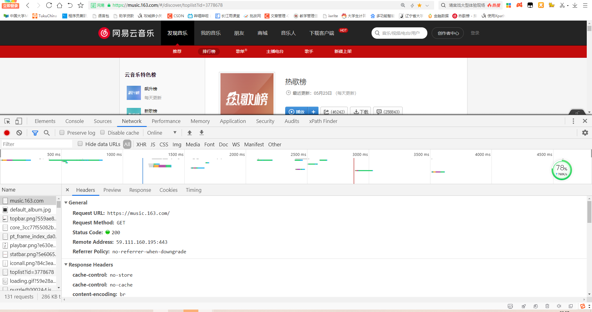
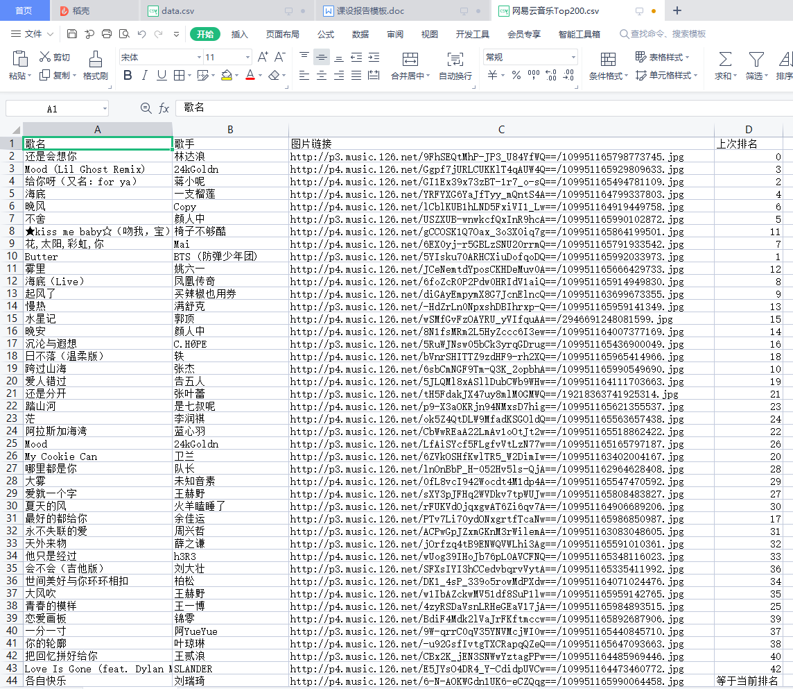
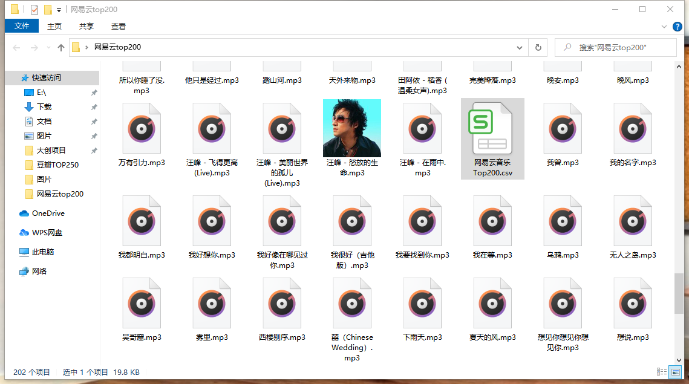
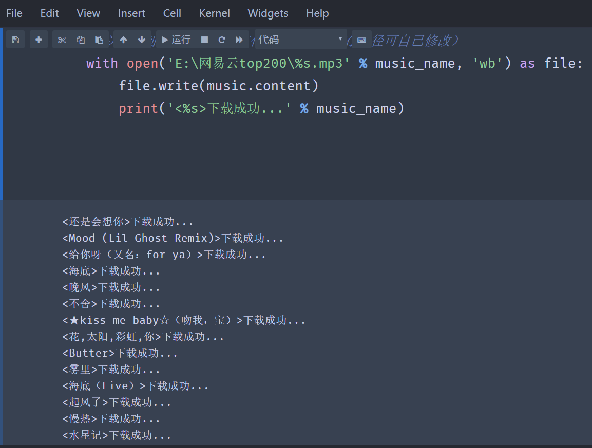

# 🎵 爬取网易云音乐热歌榜 Top200

```markdown
> 作者：Jia'nan Zhao
> 项目时间：2021年6月  
> 技术关键词：Python爬虫、Jsonpath、XPath、requests、lxml、CSV导出  
```
---

## 🧠 项目背景

本项目为《计算机网络》课程设计内容，旨在通过网络爬虫技术，抓取网易云音乐热歌榜 Top200 的歌曲信息与音频资源，进一步理解 Web 数据提取的流程及技术关键点，并培养实际开发能力。

---

## 🎯 项目目标



- 爬取网易云音乐热歌榜（榜单地址：[点击前往](https://music.163.com/#/discover/toplist?id=3778678)）；
- 提取前 200 首歌曲的：
  - 🎵 歌曲名称
  - 👤 演唱者
  - 🖼 封面图片链接
  - ⏫ 上次排名
- 下载每首歌的 MP3 文件到本地；
- 将提取结果保存为 `.csv` 文件，方便查看与后续分析。

---

## 🧩 实现方案概览

1. **页面分析**  
   使用 Chrome 开发者工具 (F12)，定位歌曲列表所在 HTML 标签，发现 JSON 数据被包裹在 `<textarea id="song-list-pre-data">` 中。

2. **主要技术栈**
   - `requests`：模拟浏览器发起请求；
   - `lxml.etree`：处理 HTML 结构提取 ID/歌名；
   - `jsonpath`：从 JSON 数据中提取字段；
   - `csv`：结果数据导出为 CSV 文件；
   - 正则表达式 + XPath：用于精确抓取网页信息。

3. **数据保存路径**
   ```bash
   E:\网易云top200\
```

---

## 🛠 项目结构与核心代码

### 🕷️ 封装爬虫类：CloudMusicSpider

```python
class CloudMusicSpider:
    def __init__(self):
        self.headers = {
            "User-Agent": "Mozilla/5.0 ..."
        }
        self.url = 'https://music.163.com/discover/toplist?id=3778678'

    def parse_url(self, url):
        return requests.get(url, headers=self.headers).text

    def get_json_data(self, html):
        json_data = re.findall('<textarea id="song-list-pre-data".*?>(.*?)</textarea>', html, re.S)[0]
        result = json.loads(json_data)

        with open('E:\\网易云top200\\网易云音乐Top200.csv', 'w', newline='', encoding='utf8') as f:
            writer = csv.writer(f)
            writer.writerow(['歌名', '歌手', '图片链接', '上次排名'])

            for section in result:
                title = jsonpath.jsonpath(section, '$.name')[0]
                artist = jsonpath.jsonpath(section, '$.artists..name')[0]
                pic = jsonpath.jsonpath(section, '$.album.picUrl')[0]
                last_rank = jsonpath.jsonpath(section, '$.lastRank') or ['等于当前排名']
                writer.writerow([title, artist, pic, last_rank[0]])

    def runspider(self):
        html = self.parse_url(self.url)
        self.get_json_data(html)
```

---

### 💾 下载歌曲到本地

```python
url_base = 'http://music.163.com/song/media/outer/url?id='

for i in range(len(id_list)):
    music_url = url_base + id_list[i]
    music = requests.get(url=music_url, headers=headers)
    with open(f"E:\\网易云top200\\{name_list[i]}.mp3", 'wb') as file:
        file.write(music.content)
        print(f"<{name_list[i]}> 下载成功！")
```

---

## 📈 技术亮点 & 问题总结

* **网页数据结构变化多端**：XPath 和正则需灵活组合。
* **编码问题排查耗时**：不同网页可能混用 UTF-8 与 GBK，需 `decode(errors="ignore")`。
* **Chrome DevTools 强大辅助**：分析网络请求、模拟 headers 是核心技能。
* **JsonPath 提取方便**：替代繁琐的嵌套访问操作，提升开发效率。
* **音频下载路径需考虑命名冲突**：建议对歌名进行转义或清洗。

---

## 📁 项目输出示意

* ✔ `网易云音乐Top200.csv`：包含歌名、歌手、封面、排名等；



* ✔ 歌曲音频保存为 `E:\网易云top200\*.mp3`；




* ✔ 控制台输出每首歌的下载状态。



---


### ✅ 完整爬虫项目代码（保存为 `netease_top200_spider.py`）

```python
import os
import requests
import json
import jsonpath
import re
import csv
from lxml import etree
from requests.exceptions import RequestException


class CloudMusicSpider:
    def __init__(self):
        self.headers = {
            "User-Agent": "Mozilla/5.0 (Windows NT 10.0; Win64; x64) "
                          "AppleWebKit/537.36 (KHTML, like Gecko) "
                          "Chrome/85.0.4183.121 Safari/537.36"
        }
        self.url = 'https://music.163.com/discover/toplist?id=3778678'
        self.base_music_url = 'http://music.163.com/song/media/outer/url?id='
        self.output_dir = './netease_top200'
        os.makedirs(self.output_dir, exist_ok=True)

    def parse_url(self, url):
        try:
            response = requests.get(url, headers=self.headers)
            if response.status_code == 200:
                return response.text
        except RequestException:
            print("请求失败")
        return None

    def get_song_ids_and_names(self, html):
        tree = etree.HTML(html)
        raw_id_list = tree.xpath('//a[contains(@href, "song?")]/@href')
        raw_name_list = tree.xpath('//a[contains(@href, "song?")]/text()')

        id_list = [id.split('=')[1] for id in raw_id_list if '$' not in id]
        name_list = [name for name in raw_name_list if '{' not in name]

        return id_list[:200], name_list[:200]

    def get_json_data(self, html):
        print("正在提取歌曲数据并导出为 CSV...")
        json_text = re.findall(r'<textarea.*?id="song-list-pre-data".*?>(.*?)</textarea>', html, re.S)
        if not json_text:
            print("未找到 JSON 数据")
            return []

        result = json.loads(json_text[0])
        csv_path = os.path.join(self.output_dir, '网易云音乐Top200.csv')

        with open(csv_path, 'w', newline='', encoding='utf8') as f:
            writer = csv.writer(f)
            writer.writerow(['歌名', '歌手', '图片链接', '上次排名'])

            for section in result:
                title = jsonpath.jsonpath(section, '$.name')[0]
                artist = jsonpath.jsonpath(section, '$.artists..name')[0]
                pic = jsonpath.jsonpath(section, '$.album.picUrl')[0]
                last_rank = jsonpath.jsonpath(section, '$.lastRank')
                last_rank = last_rank[0] if last_rank else '等于当前排名'
                writer.writerow([title, artist, pic, last_rank])

        print(f"歌曲信息已导出到 {csv_path}")

    def download_songs(self, ids, names):
        print("开始下载歌曲...")
        for music_id, music_name in zip(ids, names):
            try:
                music_url = self.base_music_url + music_id
                response = requests.get(music_url, headers=self.headers, timeout=10)

                # 文件名清理
                safe_name = re.sub(r'[\\/*?:"<>|]', '_', music_name)
                file_path = os.path.join(self.output_dir, f"{safe_name}.mp3")

                with open(file_path, 'wb') as f:
                    f.write(response.content)
                print(f"《{music_name}》下载成功")
            except Exception as e:
                print(f"下载失败: {music_name}, 错误信息: {e}")

    def run_spider(self):
        html = self.parse_url(self.url)
        if html:
            ids, names = self.get_song_ids_and_names(html)
            self.get_json_data(html)
            self.download_songs(ids, names)
        else:
            print("获取网页失败，爬虫终止")


if __name__ == '__main__':
    spider = CloudMusicSpider()
    spider.run_spider()
```

---

### 📁 输出结构示例

运行后，项目会在当前目录生成以下内容：

```
netease_top200/
├── 网易云音乐Top200.csv   # 包含歌曲名、歌手、封面链接、上次排名
├── 歌曲1.mp3
├── 歌曲2.mp3
├── ...
```

---

### 🚀 使用说明

```bash
# 安装依赖
pip install requests lxml jsonpath

# 运行程序
python netease_top200_spider.py
```

## 📝 个人心得

通过此次项目，我不仅深入掌握了网络爬虫的核心技术流程，还学会了如何使用浏览器工具辅助网页结构分析，对正则表达式与 XPath 表达能力也有显著提升。同时也加深了对编码格式、多线程下载与数据清洗的理解。

---

## 📚 参考资料

* 崔庆才《Python3 网络爬虫开发与实战》
* 沈红、李爱华《计算机网络（第2版）》
* [JsonPath 官方文档](https://goessner.net/articles/JsonPath/)
* [XPath 教程 - W3School](https://www.w3school.com.cn/xpath/index.asp)

---


